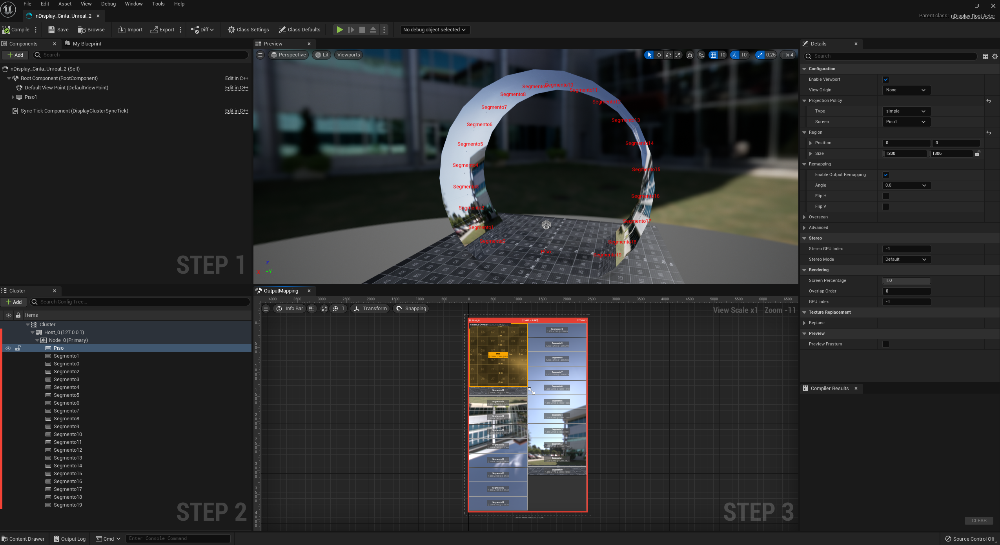
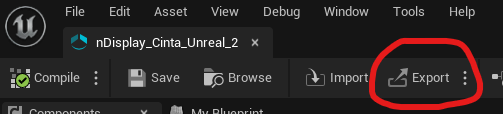
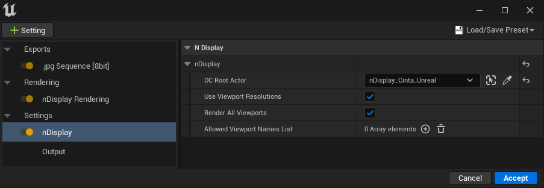
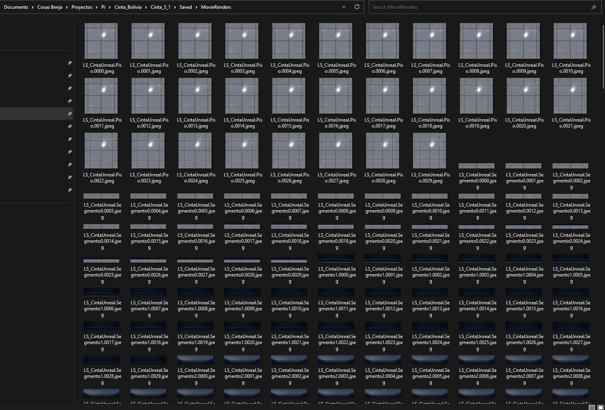
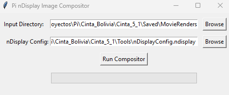
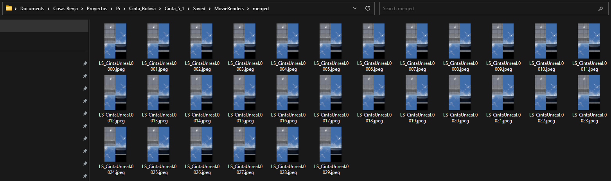

# nDisplay Merger

**nDisplay Merger** helps you composite images rendered with nDisplay using Unreal Engine’s Movie Render Queue (UE 5.1+). The desktop app (`ui.py` / `nDisplayMerger.exe`) has **two tabs**:

1. **Config Merger** — stitches nDisplay viewports into one image per frame using your `.ndisplay` **Output Mapping** (original workflow).
2. **Stereo VR Merger** — takes **left eye** and **right eye** cubemap renders (six square face images per eye per frame), runs them through **[py360convert](https://github.com/sunset1995/py360convert)** (cube map → equirectangular). Choose **output mode**: **Equirectangular stereo (over/under)** for one stacked JPEG per frame, or **Equirectangular mono** for separate equirectangular JPEGs per eye under `left_eye/` and `right_eye/`.

[](https://www.buymeacoffee.com/benjavides)

### Config Merger (nDisplay viewports)

When rendering nDisplay with Movie Render Queue, Unreal outputs **one image per viewport per frame** and does **not** compose the viewports according to the `Output Mapping` in the nDisplay configuration.  
This tab takes:

1. The **folder with the rendered images**
2. The **nDisplay configuration file** (the same one that defines the Output Mapping)

and produces **one merged image per frame**, laid out exactly as defined in the nDisplay config.

Rendered filenames are expected to follow Movie Render Queue style: tokens separated by dots, with **viewport** and **frame** as the last segments before the extension (e.g. `MyShot_01.05.Segmento0.0001.jpeg` — the level/sequence part may contain dots).


### Stereo VR Merger (cubemap → equirectangular)

Use this when you have **two folders** of cubemap face renders:

- **Left eye directory** — for each frame, six images whose viewport names include the face tokens **FRONT**, **BACK**, **LEFT**, **RIGHT**, **UP**, **DOWN** (matched as separate words; case-insensitive).
- **Right eye directory** — the **same frame numbers** and the same face layout as the left folder.

Naming is the same tail pattern as above: `{LevelSequence}.{ViewportWithFaceToken}.{Frame}.{jpeg|jpg|png}`. The tool pairs frames across both folders.

**Output modes** (GUI **Output mode** dropdown, or `output_mode` when calling `stereo_merger.main` in Python):

| Mode | Files |
|------|--------|
| **Equirectangular stereo (over/under)** | One JPEG per frame: left eye on top, right on bottom — `{LevelSequence}.StereoEquirect.{Frame}.jpeg` in the output folder. |
| **Equirectangular mono** | One equirectangular JPEG per eye: `{LevelSequence}.Equirect.{Frame}.jpeg` in `{output}/left_eye/` and the same basename in `{output}/right_eye/`. |

If you leave **output** empty, the base folder defaults to `merged_stereo` next to the parent of the left eye folder (mono mode still creates `left_eye` and `right_eye` inside that base folder).

**Memory:** each stereo frame uses a lot of RAM inside `py360convert` (especially at 2K/4K face resolution). In the UI, use a low **Workers** value (often 1–2) on this tab if you see out-of-memory issues. Stereo conversion is invoked from the GUI or by calling `stereo_merger.main(...)` in Python; there is no separate stereo CLI entry point.

---

### Requirements

- **Python 3.9+** (tested with 3.9/3.10)
- Unreal Engine **5.1 or later** (for Movie Render Queue with nDisplay)
- The Python dependencies in `requirements.txt` (includes **simplejpeg** / libjpeg-turbo for faster JPEG read/write, plus **numpy**, **scipy**, and **py360convert** for the Stereo VR tab)

Create and activate a virtual environment (recommended):

```bash
# from the project root
python -m venv .venv

# Windows (PowerShell)
.venv\Scripts\Activate.ps1

# Windows (cmd.exe)
.venv\Scripts\activate.bat

pip install -r requirements.txt
```

---

### How to Use (GUI – recommended)

Launch `nDisplayMerger.exe` (see **Compile to Executable**) or `python ui.py`. Use **Run** / **Pause** / **Resume** and **Stop** in the footer; set **Start frame** / **End frame** and **Workers** on the active tab. The **?** button on each tab opens detailed help.

#### Config Merger tab

1. **Create your nDisplay config**
   - In Unreal, set up your nDisplay configuration as usual.
     
   - Make sure the **Output Mapping (STEP 3)** is correctly configured – this defines how the viewports will be laid out in the final image.
   - Export the configuration as an `.ndisplay` file.
     
   - The exported config is what nDisplay Merger will read.
   
2. **Render with Movie Render Queue (nDisplay)**
   - Use Movie Render Queue with your nDisplay setup (UE 5.1+).
     
   - The render output should be a folder containing images named per viewport and frame (e.g. `LevelSequence.Segmento0.0001.jpeg`).
   
     
   
3. **Run the merger**
   - Select the **input directory** (rendered images) and the **nDisplay config** (`.ndisplay`).
   - Optionally set an **output directory**; otherwise output goes to a `merged` folder inside the input directory.
   - Adjust **Workers** if you want more or fewer parallel frame jobs.
     
   
4. **Review the result**
   - You get **one composed image per frame**, following the Output Mapping from the config.
     

#### Stereo VR Merger tab

1. Render **left** and **right** cubemap face sequences into **two separate folders** (same frame numbering; six faces per frame per eye, with FRONT/BACK/LEFT/RIGHT/UP/DOWN in the viewport token, as in the in-app help).
2. Choose **Left eye** and **Right eye** directories, **Output mode** (over/under stereo vs per-eye mono), optional **output** path, frame range, and **Workers** (keep low for heavy resolutions).
3. Click **Run** and open the output folder when the job finishes.


---

### Command Line Usage

You can also run nDisplay Merger directly from the command line:

```bash
python .\nDisplayMerger.py .\Example\MovieRenders .\Example\nDisplayConfig.ndisplay
```

Where:

- `.\Example\MovieRenders` is the folder with the rendered viewport images.
- `.\Example\nDisplayConfig.ndisplay` is the exported nDisplay config file.

Optional: `--jobs N` sets how many frames merge in parallel (default: up to 16 workers, capped by CPU count). Use `--jobs 1` for sequential processing.

This will create a `merged` folder inside `.\Example\MovieRenders` with one composed image per frame.

**Stereo VR** processing is not exposed as a separate CLI script; use the **Stereo VR Merger** tab or call `stereo_merger.main(...)` from Python.

---

### Compile to Executable (Windows)

If you want to ship a standalone executable (no Python required for end users), you can build it with PyInstaller:

```bash
python -m PyInstaller --onefile --windowed ui.py --additional-hooks-dir=. --name=nDisplayMerger --icon=assets\app.ico
```

This will generate `dist\nDisplayMerger.exe`, which you can distribute to artists/TDs. The application name is **nDisplay Merger**, and the executable file name is `nDisplayMerger.exe`.

