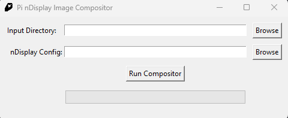

# nDisplay Merger

When rendering nDisplay with the Movie Render Queue in Unreal 5.1 it exports one image per viewport per frame. It doesn't merge the viewports the way it is specified in the Output Mapping window. This program takes a nDisplay configuration file and the folder with the renders and merges the images of each viewport following the instructions in the nDisplay config.



## Setup

```
pip install -r requirements.txt
```

## Compile to Executable

```
python -m PyInstaller --onefile --windowed ui.py --additional-hooks-dir=. --name=nDisplayMerger --icon=assets\app.ico
```

## Source Code Usage

```
python .\nDisplayMerger.py .\MovieRenders nDisplayConfig.ndisplay
```
